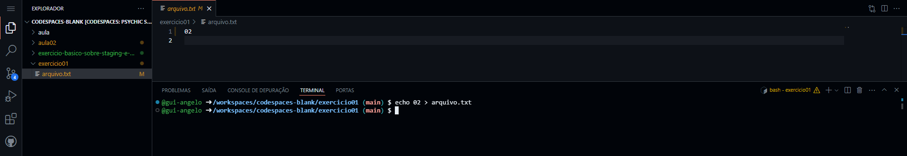
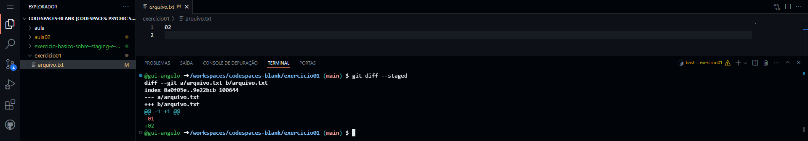
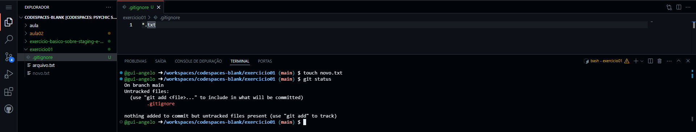

# EXERCICIO 01 - ENTREGA

## EXERCÍCIO – Básico sobre staging / commit:

> [!IMPORTANT]
> Exemplo: no exercício, a etapa B diz sobre "Adicionar o arquivo no staging e conferir o status". Então, a linha correspondente no arquivo README.md que deverá ser salva é o que foi feito por você para chegar no resultado solicitado (comandos, saída de tela):

### a) No working dir, executar o comando: `echo 01 > arquivo.txt`

**Comando executado e retorno do comando**
``` bash
@gui-angelo ➜ /workspaces/codespaces-blank/exercicio01 $ git init
Initialized empty Git repository in /workspaces/codespaces-blank/exercicio01/.git/
@gui-angelo ➜ /workspaces/codespaces-blank/exercicio01 (main) $ echo 01 > arquivo.txt
```
**Print completo do comando executado e retorno do arquivo criado ao lado esquerdo da imagem**


### b) Adicionar o arquivo no staging e conferir o status

**Adicionado todos os arquivos modificados/criados ao staging e conferindo o status**
``` bash
@gui-angelo ➜ /workspaces/codespaces-blank/exercicio01 (main) $ git add .
@gui-angelo ➜ /workspaces/codespaces-blank/exercicio01 (main) $ git status
On branch main

No commits yet

Changes to be committed:
  (use "git rm --cached <file>..." to unstage)
        new file:   arquivo.txt

@gui-angelo ➜ /workspaces/codespaces-blank/exercicio01 (main) $
```


### c) Commitar o arquivo do staging com a descrição `"git add example - arquivo.txt“`
**Realizado o commit com a descrição informado para o passo c)**

``` bash
@gui-angelo ➜ /workspaces/codespaces-blank/exercicio01 (main) $ git commit -m "git add example - arquivo.txt"
[main (root-commit) 92a5945] git add example - arquivo.txt
 1 file changed, 1 insertion(+)
 create mode 100644 arquivo.txt
@gui-angelo ➜ /workspaces/codespaces-blank/exercicio01 (main) $
```


### d) Sobrescrever o conteúdo do arquivo.txt: `echo 02 > arquivo.txt`

**Sobrescrevendo o arquivo adicionando um novo conteúdo**
``` bash
@gui-angelo ➜ /workspaces/codespaces-blank/exercicio01 (main) $ echo 02 > arquivo.txt
@gui-angelo ➜ /workspaces/codespaces-blank/exercicio01 (main) $
```



### e) Verificar o diffing no arquivo

**Verificando Diff do arquivo**
``` bash
@gui-angelo ➜ /workspaces/codespaces-blank/exercicio01 (main) $ git diff
diff --git a/arquivo.txt b/arquivo.txt
index 8a0f05e..9e22bcb 100644
--- a/arquivo.txt
+++ b/arquivo.txt
@@ -1 +1 @@
-01
+02
@gui-angelo ➜ /workspaces/codespaces-blank/exercicio01 (main) $
```


### f) Adicionar novamente o arquivo no staging e conferir o status

**Abaixo mostro o status antes de adicionar o arquivo para staging e após adicionar ao staging**
``` bash
@gui-angelo ➜ /workspaces/codespaces-blank/exercicio01 (main) $ git status
On branch main
Changes not staged for commit:
  (use "git add <file>..." to update what will be committed)
  (use "git restore <file>..." to discard changes in working directory)
        modified:   arquivo.txt

no changes added to commit (use "git add" and/or "git commit -a")
@gui-angelo ➜ /workspaces/codespaces-blank/exercicio01 (main) $ git add .
@gui-angelo ➜ /workspaces/codespaces-blank/exercicio01 (main) $ git status
On branch main
Changes to be committed:
  (use "git restore --staged <file>..." to unstage)
        modified:   arquivo.txt

@gui-angelo ➜ /workspaces/codespaces-blank/exercicio01 (main) $
``` 


### g) Verificar o diffing no arquivo
**Realizando a validação do Diff com o parâmetro --staged que mostra o diffing nos arquivos na área de staging:**

``` bash
@gui-angelo ➜ /workspaces/codespaces-blank/exercicio01 (main) $ git diff --staged
diff --git a/arquivo.txt b/arquivo.txt
index 8a0f05e..9e22bcb 100644
--- a/arquivo.txt
+++ b/arquivo.txt
@@ -1 +1 @@
-01
+02
@gui-angelo ➜ /workspaces/codespaces-blank/exercicio01 (main) $
``` 



### h) Sobrescrever o conteúdo do arquivo.txt: `echo 03 > arquivo.txt`
``` bash
@gui-angelo ➜ /workspaces/codespaces-blank/exercicio01 (main) $ echo 03 > arquivo.txt
@gui-angelo ➜ /workspaces/codespaces-blank/exercicio01 (main) $
```


### i) Verificar o diffing no arquivo
****
``` bash
@gui-angelo ➜ /workspaces/codespaces-blank/exercicio01 (main) $ git diff
diff --git a/arquivo.txt b/arquivo.txt
index 9e22bcb..75016ea 100644
--- a/arquivo.txt
+++ b/arquivo.txt
@@ -1 +1 @@
-02
+03
@gui-angelo ➜ /workspaces/codespaces-blank/exercicio01 (main) $
```


### j) Fazer o restore do arquivo da área de staging e verificar o status

**Realizando o restore do arquivo no modo --staged e validando o status**
``` bash
@gui-angelo ➜ /workspaces/codespaces-blank/exercicio01 (main) $ git restore --staged arquivo.txt
@gui-angelo ➜ /workspaces/codespaces-blank/exercicio01 (main) $ git status
On branch main
Changes not staged for commit:
  (use "git add <file>..." to update what will be committed)
  (use "git restore <file>..." to discard changes in working directory)
        modified:   arquivo.txt

no changes added to commit (use "git add" and/or "git commit -a")
@gui-angelo ➜ /workspaces/codespaces-blank/exercicio01 (main) $
```


### k) Realizar o commit do arquivo e verificar o log

**Commit realizado e verificado com `git log`**
``` bash
@gui-angelo ➜ /workspaces/codespaces-blank/exercicio01 (main) $ git add .
@gui-angelo ➜ /workspaces/codespaces-blank/exercicio01 (main) $ git commit -m "Realizando commit para salvar as alterações realizadas"
[main 7abb7e5] Realizando commit para salvar as alterações realizadas
 1 file changed, 1 insertion(+), 1 deletion(-)
@gui-angelo ➜ /workspaces/codespaces-blank/exercicio01 (main) $ git log
commit 7abb7e5cbbab0c3d1147f2a72ac67548ea9a607a (HEAD -> main)
Author: gui-angelo <66852753+gui-angelo@users.noreply.github.com>
Date:   Thu Aug 8 03:07:07 2024 +0000

    Realizando commit para salvar as alterações realizadas

commit 92a59455b742fd712f3a97c8f9f95c93aefaa593
Author: gui-angelo <66852753+gui-angelo@users.noreply.github.com>
Date:   Thu Aug 8 02:38:21 2024 +0000

    git add example - arquivo.txt
@gui-angelo ➜ /workspaces/codespaces-blank/exercicio01 (main) $
```


### l) Adicionar um arquivo gitignore com o seguinte conteúdo: `*.txt`

**Criado o arquivo e adicionado o conteúdo *.txt**
``` bash
@gui-angelo ➜ /workspaces/codespaces-blank/exercicio01 (main) $ touch .gitignore
@gui-angelo ➜ /workspaces/codespaces-blank/exercicio01 (main) $
```


### m) Criar um arquivo novo.txt e verificar o status

**Criado novo arquivo novo.txt e verificando o status**
``` bash
@gui-angelo ➜ /workspaces/codespaces-blank/exercicio01 (main) $ touch novo.txt
@gui-angelo ➜ /workspaces/codespaces-blank/exercicio01 (main) $ git status
On branch main
Untracked files:
  (use "git add <file>..." to include in what will be committed)
        .gitignore

nothing added to commit but untracked files present (use "git add" to track)
@gui-angelo ➜ /workspaces/codespaces-blank/exercicio01 (main) $
```



> [!WARNING]
> Ao final, informar para o professor a URL de clone via HTTPS do GitHub para o seu repositório publico criado.